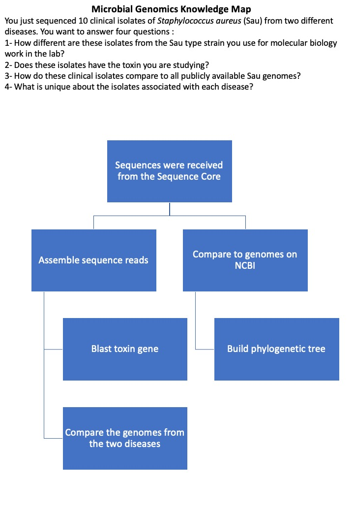

# Microbial Genomics Journey Workshop Gaborone 2024

## Why is it important to learn microbial genomics?

You might already know the answer.

[__Torsten__ __Seemann__](https://github.com/tseemann/)

An hour of bioinformatics can save a week in the lab.
ALSO
An hour in the lab can save a week of bioinformatics.

## Aim

Acquire enough knowledge and skills to use microbial genomics approaches in Your project.

## Tips

1. Practice, practice, practice.

2. Map your Knowledge out.

3. Update your Knowledge Map.

4. know<-do not know<- do not know that I do not know.

5. You do not necessarily need denovo scripting (coding) to process data.

6. Use defaults unless you know what you are doing.

7. Attending workshops and courses are important, but the practice is more important.

8. Reproducibility.

9. Coding would help in data reformatting and analyses in unique ways.

## Knowledge Map
Map your Microbial Genomics knowledge out. Knowledge mapping helps communicate information and solve complex problems. Think about the concepts, procedure and competencies. It will help you advance your current understandings of microbial genomics or any other field. Knowledge maps will also serve as a visual aid representing ideas and their resources. We will start the course with a knowledge map and update it in the last session of the course. Please use the provided example to map out your microbial genomics knowledge. The Microbial genomics knowledge map shared [here](Knowledge_Map_1.pptx) is very simple. Try to be very detailed about each step and process. You can produce more than one map for the different main processes and we will try to combine them in one map by the end of the course.


---

## Unix

### Why would I need to use command-line?

- Many bioinformatics tools do not have GUI and would need to be run on the command-line.
- Combining multiple tools into automated scripts.
- Using High performance computing (HPC) to run complex analyses (e.g. Analyze 1 million genomes or more).

### How to open a terminal?

The terminal window reads a line of input and execute the commands and print an output to the terminal. You can open several Terminal windows at once.

#### Windows
Follow instructions for installing Windows Subsystem for Linux (WSL) on https://docs.microsoft.com/en-us/windows/wsl/install-win10<br/>
Briefly:
1. Open PowerShell as Administrator (right click to see that option) and run:
```
Enable-WindowsOptionalFeature -Online -FeatureName Microsoft-Windows-Subsystem-Linux
```
2. Install Linux distribution app from Microsoft Store (tested on [Ubuntu 18.04 LTS](https://www.microsoft.com/store/apps/9N9TNGVNDL3Q)).
3. Set up username and password. You can try a command to test the system.
```
pwd
```
This will print your parent directory path.

Note: Your Windows C:\Users\ gets mapped to /mnt/c/Users/ in WSL. You can copy between the two directories using a command like:
```
cp /mnt/c/Users/Windows_username/Desktop/file.fasta /home/Ubuntu_user_name/
```

#### Mac
To bring up the command-line, use the Finder to navigate to _Applications->Utilities_ and double-click on the _Terminal_.<br/>
```
pwd
```
This will print your parent directory path.

### Make a New Folder
Make a new folder (MGJW) to use as a working directory during the workshop.
```
cd
mkdir MGJW
cd MGJW
```

### Running Commands
Type in a command and press the Enter key.  An example command and output:
```
ahmed$ ls
checkm  genome_assemblies  iqtree  mash  mlst  prokka  reads  roary  skesa  snippy				
```

### Useful Unix Commands

Unix commands are actually executable programs.  When you type a command, it will search through all the directories in the PATH environment variable. If found, it will be executed. If not, it will give a "command not found" error.

| Command                     | Description                              |
| --------------------------- | ---------------------------------------- |
| `pwd`   | Command to see where you are "Parent Working Directory" |
| `cd /go_to_path/`    | Change current working directory |
| `ls`    | Lists files in a directory. `ls -l` (long listing), `ls -lh` (human-readable format, must be used with `-l`), `ls -a` (all, including hidden files). |
| `mv filename1 filename2`    | Move or rename a file or directory.  |
| `cp filename1 filename2`    | Copy a file. Use `-R` for copying directories recursively         |
| `chmod` | Change the read, write, and execute permissions of a file or directory. Use `ls -l` to show the permissions of files in a directory |
| `mkdir` | Make a directory.                         |
| `rm`    | Remove (delete) a file. This will delete it permanently. Use `-R` to remove directories and their contents recursively. You can use `rm -i`, which will ask for confirmation before deleting anything.           |
| `head`            | View the first few lines of a file.  You can control how many lines to view. |
| `tail`            | View the end of a file. |
| `less`            | A version of `more` with more features.                      |
| `wc filename`              | Count `-w` words, `-l` lines and/or `-m` characters in a file. This can be used for knowing how many reads are in a fastq file   |
| `history` | Show all the commands that were run recently |

### Useful Command-Line Shortcuts and Keystrokes

| Shortcut/Keystroke          | Description                              |
| --------------------------- | ---------------------------------------- |
| tab | Automatic command completion using the tab key. |
| Left arrow &larr; and right arrow &rarr; | Move the text insertion point (cursor) one character to the left or right. |
| Up &uarr; and down &darr; arrows | Move up and down in the command history. This lets you edit/rerun previous commands. |
| control-a (^a) | Move the cursor to the start of the line. |
| control-e (^e) | Move the cursor to the end of the line. |
| control-d (^d) | Delete the character currently under the cursor. D=Delete. |

Use Example:

```
ahmed$ ch<tab><tab>
ahmed$ ch
chat      checknr   chfn      chmod     chpass    chsh      
checkgid  chflags   chgrp     chown     chroot
```

### Wildcards

`*` stands for zero or more characters. For example, to list all fasta files with the extension ".fasta", run `ls` with the wildcard pattern "*.fasta"

```
ahmed$cd genome_assemblies
ahmed$ls *.fasta
GCA_000558485.1_Stap_aure_M0236_V1_genomic.fna  GCA_900637155.1_49386_H02_genomic.fna  
Staph.beads.309_contam.fna  marc.bacteremia.547.a.fna GCA_000772025.1_ASM77202v1_genomic.fna          Staph.bead.162.fna  marc.bacteremia.188.a.fna GCA_001900095.1_ASM190009v1_genomic.fna         
Staph.bead.183.fna  marc.bacteremia.519.a.fna
```
You can also be more specific on what you are looking for
```
ahmed$ls *18*.fna
Staph.bead.183.fna  marc.bacteremia.188.a.fna
```

### Command Line Arguments

Many commands take arguments.  Positional arguments are often the names of one or more files that the command will operate on.  Most commands take "options", which fine-tune what the command does.  For example, while `wc -l file_name.txt` or `wc --lines file_name.txt` will only count number of lines in the file, `wc file_name.txt` will count number of lines, words and bytes in the file. Also, many commands will give a brief usage summary when you call help `-h` or `--help`.


### Standard Input and Output Redirection

Unix programs start out with three connections to the outside world. By default, commands take 1) input from the standard input and send the 2) results and 3) errors to standard output and standard error, respectively. By default, this is your screen. You can use a file as input and write the results of a command to a file, which is called input/output redirection.

| Connection Type     | Description                                                  |
| ------------------- | ------------------------------------------------------------ |
| standard input  | Input from keyboard or expects a file path on the command line. Redirect standard input from a file with < |
| standard output | It prints to your screen. Redirect standard output to a file with > |
| standard error  | It prints to your screen. Redirect standard error to a file with 2> |

Use Example:

```
ahmed$ ls -la
ahmed$ ls -la > list_directory.txt
ahmed$ less < list_directory.txt
ahmed$ less list_directory.txt
ahmed$ less list_directory.tt
ahmed$ less list_directory.tt 2> stderr.txt
```
In this example, I ran the `ls` command and it printed stdout to screen.  In the second command, I redirected stdout to a file. I then used the `less` command to read the file using the standard input `<`  symbol. I can also do that without the `<` symbol as most programs expect a file path on the command line. In command 5, I used a wrong file name `.tt` that does not exist in this folder so an error message was printed to the screen `list_directory.tt: No such file or directory`. In the following command, I redirected the error to stderr file that I named stderr.txt. You can also redirect both stdout and stderr to a file using `&> myfile.txt`.


```
ahmed$ wc -l list_directory.txt
ahmed$ ls -la | wc -l list_directory.txt
```
The `wc` program counts `-w` words, `-l` lines and/or `-m` characters in a file or in data sent to its standard input. In the first command we used the file we created in the previous commands `list_directory.txt` to count number of lines in this file. We can also redirect standard output to another command with the pipe `|`. This is a very powerful approach where you can pipe multiple commands. Imagine having a fastq file with all the sequence reads (each read is written in 4 lines) and you only want to know how many reads in the file and you do not need to save `wc -l` output. You can try the following command
```
wc -l list_directory.txt | awk '{print $1/3}'
```

---

## GitHub
[GitHub](https://github.com/) is a Version Control System Server which is good for collaborations, storing versions, restoring previous versions, and managing backups. The concept is simple. You have a local copy of the project/repository and a remote copy. The local copy is stored on your computer and the remote is online (e.g. GitHub). You can use a web browser or terminal to interact with the remote server (GitHub) and the terminal to interact with the local copy.

### Make an account
Please make an account on [GitHub](https://github.com/signup?ref_cta=Sign+up&ref_loc=header+logged+out&ref_page=%2F&source=header-home) (Free). You will need the account to import or create repositories, collaborate with others, and connect with the GitHub community (e.g. posting issues in the tool repository).

### Cloning a Repository

Sometimes you want to download and a repository from GitHub. Let's clone the Workshop material.

1. Go to our [MGJW GitHub Repository](https://github.com/ahmedmagds/Microbial-Genomics-Journey-Workshop-Gabs24.git)
2. Click the 'Code' Button
3. Copy the URL
4. _Clone_ the repository to your local machine
   `git clone https://github.com/ahmedmagds/Microbial-Genomics-Journey-Workshop-Gabs24.git`

Now you have a copy of the Workshop material on your computer!

**Tip: Don't clone a git repository into another git repository.**

### Updating a Local Repository

If changes are made to any of these files in the online, remote repository, you can use this command to update your local copy.
```
cd Microbial-Genomics-Journey-Workshop-Gabs24
git pull
```
---

## Conda
[Conda](https://docs.conda.io/projects/conda/en/latest/index.html) is an open-source package management system and environment management system that runs on Windows, macOS, and Linux. Conda quickly installs, runs, and updates packages and their dependencies. Conda easily creates, saves, loads, and switches between environments on your local computer. It was created for Python programs but it can package and distribute software for any language.

### Install miniconda for Windows and Linux
```
wget https://repo.anaconda.com/miniconda/Miniconda3-latest-Linux-x86_64.sh
bash ./Miniconda3-latest-Linux-x86_64.sh
source .bashrc
```
Follow instructions after the bash command and keep confirming and accepting.<br/>
You can then use the source command to activate conda in your current session or close and reopen the app.<br/>

### Install miniconda for Mac
Paste this link in your browser https://repo.anaconda.com/miniconda/Miniconda3-latest-MacOSX-x86_64.sh
```
cd ~/Downloads
bash ./Miniconda3-latest-MacOSX-x86_64.sh
source .bash_profile
```
Follow instructions after the bash command and keep confirming and accepting.<br/>
You can then use the source command to activate conda in your current session or close and reopen the app.<br/>

### Install mamba
Let's try conda. First tool to install is a tool that replaces conda :).<br/>
[Mamba](https://mamba.readthedocs.io/en/latest/index.html) is a fast, robust, and cross-platform package manager. It is a CLI tool to manage conda s environments. It is considered as a drop-in replacement for conda, offering higher speed and more reliable environment solutions.
```
conda install -c conda-forge mamba
```
Mamba is now installed in the conda base environment.

## Bioconda
* [Bioconda](https://bioconda.github.io/) lets you install thousands of software packages related to biomedical research using the conda package manager.
* You will need a one-time set up to set up the channels for bioconda.
```
conda config --add channels defaults
conda config --add channels bioconda
conda config --add channels conda-forge
conda config --set channel_priority strict
```
**Now you are ready to install new tools. It is highly recommended to create a new environement for each tool separetely. Why do you think we need new env?**
### Install blast
[blast](https://www.ncbi.nlm.nih.gov/books/NBK279690/)
```
mamba create -n blast -c bioconda blast
conda activate blast
blastn
```
---
## Further Readings
* [Unix Command Reference](https://files.fosswire.com/2007/08/fwunixref.pdf)
* [Illumina Sequencing by Synthesis Video](https://youtu.be/fCd6B5HRaZ8)
* [Biostar](https://www.biostars.org/) An Online Question & Answer Resource for the Bioinformatics Community
