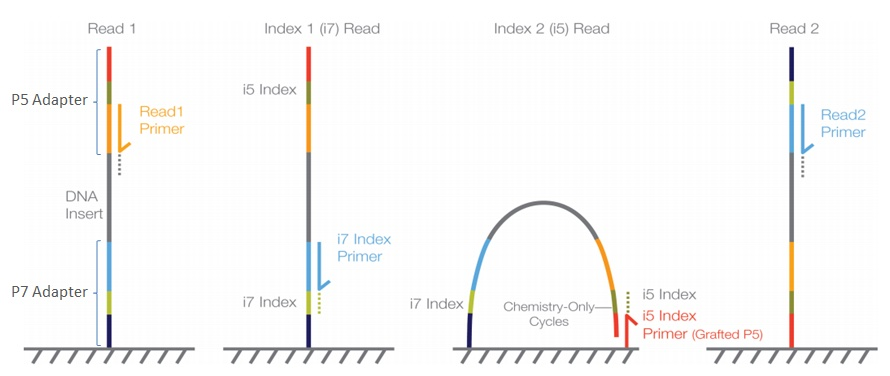
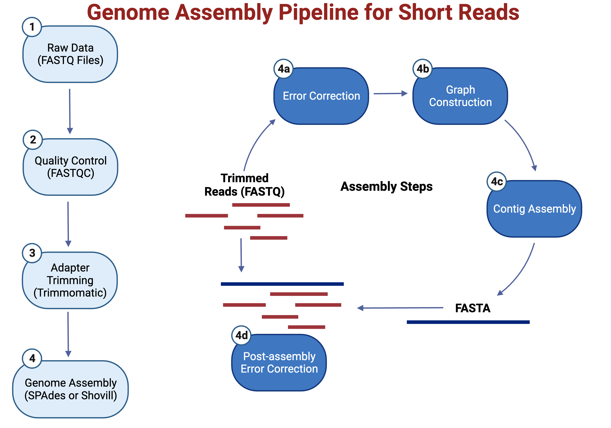
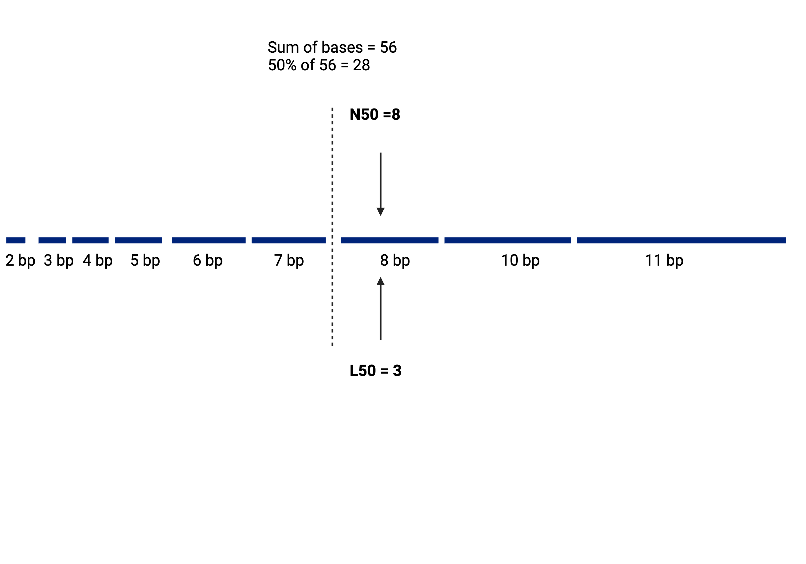
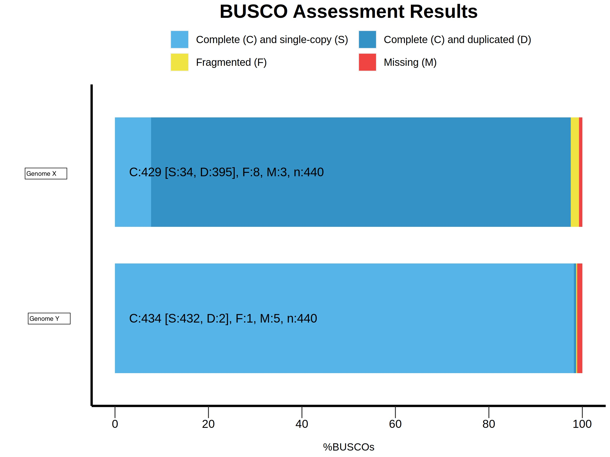

# Microbial Genomics Journey Workshop Gaborone 2024
## Part 3: Assembly

## Intro

<br/>Illumina Figure showing a paired-end flow cell for MiSeq, HiSeq 2000/2500 and NovaSeq 6000<br/>

**Sample Multiplexing**
Sample multiplexing allows large numbers of libraries to be pooled and sequenced on a single run. This will drastically reduce cost. There are 384 Unique Dual Indexes (Sets A, B, C and D). This means a total of 384 samples can be multiplexed on a single lane.

**Adapter Trimming**
Adapter trimming is the process of removing adapter sequences from the 3’ ends of reads. Adapter sequences should be removed from reads because they interfere with downstream analyses, such as alignment of reads to a reference. it is necessary to eliminate adapter sequences from reads. These adapter sequences contain important elements, including the sequencing primer binding sites, the index sequences, and the sites that facilitate the attachment of library fragments to the flow cell lawn. You can use [trimmomatic](http://www.usadellab.org/cms/?page=trimmomatic) for this trimming step. Some assemblers give you the option to trim the reads as part of the assembly process.

**Genome Assembly**
In bioinformatics, genome assembly is the process of putting a large number of short DNA sequences into the correct order to recreate the original genome from which the DNA came. There are two types of genome assembly: de novo assembly and mapping/reference-based assembly.

* The process starts with a reads file (sample.fastq). Sequence reads can be submitted to databases like Sequence Reads Archive (SRA).
* De novo assembly is the process of creating a novel genome from scratch without the aid of reference/template data. This is the standard approach for bacteria. The most common assembly mechanism for short reads is de Bruijn graph, which is a directed graph that represents overlaps between sequences of symbols.
* A reference/mapping-based assembly needs a reference genome to be used as a representative example of a species’ set of genes. Once the reference genome is available, the genome assembly of every new sample becomes much easier and quicker. This is the standard approach for human and viruses genomes.
* The final product is usually a fasta file that has segments of contiguous base pairs (1 or more contig/s).  
* Draft genome: Multiple contigs per chromosome or genomic interspersed with gaps of unknown sequences.
* Complete genome: 1 single contig for the entire chromosome/plasmid.
* We usually submit genome assemblies to databases such as European Nucleotide Archive and NCBI Assembly (GenBank).



**What do make the assembler task more difficult?**
* Contamination
* Adapter Sequences not trimmed
* Repetitive Sequences
* Low Coverage
* Poor Quality Reads

**Assembly Statistics**

|  Metric             | Description                                                  |
| ------------------- | ------------------------------------------------------------ |
| N50  | Sequence length of shortest contig at 50% of the assembly length |
| L50 | The smallest number of conitgs whose bases sum makes 50% of of the assembly length |
| Coverage | Number of Seq reads covering each nucleotide in the genome (e.g. 40x) |



## skesa
It is a tool to assemble bacterial isolate genomes from Illumina paired-end reads. The SPAdes genome assembler is the standard de novo genome assembler for Illumina whole genome sequencing data of bacteria and other small microbes. [skesa](https://github.com/ncbi/SKESA) is a tool for genome assembly.<br/>

Let's assemble our first genome.
```
cd /data/reads
ls
cd /data/skesa
bash skesa_instruction.sh
```
What is inside this script?
`less skesa_instruction.sh`

```
skesa --reads /data/reads/Staph.bead.183_1.fastq.gz,/data/reads/Staph.bead.183_2.fastq.gz --cores 16 --memory 8 > Staph.bead.183.fna
```
Let's check a genome assembly file
`less /data/genome_assemblies/Staph.bead.183.fna`

**What would be the first fastest way of checking a quality of a genome assembly?**
`ls -lh /data/genome_assemblies/`

## Checkm
It provides a set of tools for assessing the quality of genomes recovered from isolates, single cells, or metagenomes. It provides robust estimates of genome completeness and contamination by using collocated sets of genes that are ubiquitous and single-copy within a phylogenetic lineage.
```
cd /data/checkm
bash checkm_instruction.sh
```
What is inside this script?
```
checkm lineage_wf -x fna /data/genome_assemblies/ /data/checkm/
```
Let's check the results
```
less checkm_result.txt
```

## Mash
It is a Fast genome and metagenome distance estimation using MinHash. It turns large sequences to small, representative sketches. It compares a pair of genomes and approximates similarity between them in nucleotide content. It can be used for checking contamination and screening of your newly sequenced genome against the entire RefSeq database. You will need your genome and a mash RefSeq database (included in the workshop folder).<br/>
Let's check the mockdna sample in the fastq folder. Mash can handle one file for the sample so we will have to concatenate our reads.
```
cd /data/mash
ls
cd result
less marc.bacteremia.188.a.fna_sorted_mash.tab
```
Let's check another sample and see how this compares to previous results.
```
less Staph.beads.309_contam.fna_sorted_mash.tab
```
## Further Readings
* [Shovill](https://github.com/tseemann/shovill)
* [Quast](https://www.youtube.com/watch?v=ViXzKrQo25k)
* [Busco](https://academic.oup.com/bioinformatics/article/31/19/3210/211866)
* [Busco_lineages](https://busco.ezlab.org/list_of_lineages.html)
