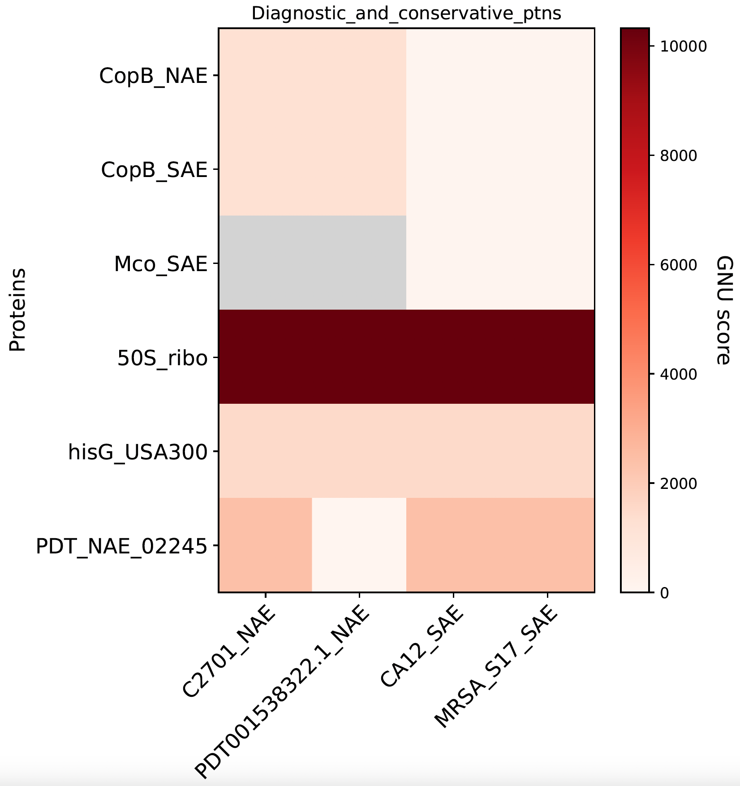

# Microbial Genomics Journey Workshop Gaborone 2024
## Part 8: Panallelome analysis
With the rapid growth of genomic databases and reduced sequencing costs, scalable tools are essential for categorizing, classifying, and measuring genomic novelty. Traditional methods, which use single reference sequences for comparison, have limitations in identifying polymorphisms. Using multiple references or the entire database of reference genomes can be computationally challenging.<br/>
**Are the identified polymorphisms rare or widespread in the natural variation of the species?**<br/>


## WhatsGNU
[WhatsGNU](https://github.com/ahmedmagds/WhatsGNU) is a tool for identifying proteomic novelty. WhatsGNU utilizes the natural variation in public databases to rank protein sequences based on the number of observed exact protein matches (the GNU score) in all known genomes of a certain species & can quickly create whole protein reports. WhatsGNU compresses proteins database based on exact match to much fewer number of proteins that differ by at least one amino acid. Six precompressed databases (.pickle) are available to download and use:
Ortholog Mode:
* Klebsiella pneumoniae Version: 04/17/2020 (compressed 46,072,343 proteins in 8752 genomes to 1,466,934 protein variants).
* Mycobacterium tuberculosis Version: 07/09/2019 (compressed 26,794,006 proteins in 6563 genomes to 434,725 protein variants).
* Pseudomonas aeruginosa Version: 07/06/2019 (compressed 14,475,742 proteins in 4712 genomes to 1,288,892 protein variants).
* Staphylococcus aureus Version: 06/14/2019 (compressed 27,213,667 proteins in 10350 genomes to 571,848 protein variants).
Big Data basic Mode:
* Salmonella enterica Enterobase Version: 08/29/2019 (compressed 975,262,506 proteins in 216,642 genomes to 5,056,335 protein variants).
* Staphylococcus aureus Staphopia Version: 06/27/2019 (compressed 115,178,200 proteins in 43,914 genomes to 2,228,761 protein variants).

#### WhatsGNU_plotter.py

This script plots:
* Heatmap of GNU scores of orthologous genes in different isolates.
* Metadata distribution bar plot of proteins.
* Histogram of the GNU scores of all proteins in a genome.
* Volcano plot showing proteins with a lower average GNU score in one group (case) compared to the other (control). The x-axis is the delta average GNU score (Average_GNU_score_case – Average_GNU_score_control) in the ortholog group. Lower average GNU score in cases will have a negative value on the x-axis (red dots) while lower average GNU score in the control group will have positive value on the x-axis (green dots). The y-axis could be drawn as a -log10(P value) from Mann–Whitney-Wilcoxon test. In this case, lower average GNU score in one group (upper left for case or upper right for control) would be of interest as shown by a significant P value (-log10( P value) > 1.3). The y-axis can also be the average OVRI in the case group for negative values on the x-axis or average OVRI in the control group for positive values on the x-axis.
Let's Try WhatsGNU!

### Installation
#### Conda
```
mamba create -n whatsgnu -c bioconda whatsgnu
conda activate whatsgnu
```
### Usage
* Check Proteomic Novelty for some genomes. Make a directory and put all 4 faa files in it. Use this command to run WhatsGNU.
```
WhatsGNU_main.py -d WhatsGNU_Sau_Ortholog/Sau_Ortholog_10350.pickle -dm basic faa/
```

Let's explore the output files. You will get 3 files for each genome with the previous command.
* _report.txt --- tab-separated output file showing the GNU score for each individual protein in the genome.
* _topgenomes.txt --- top 10 genomes with hits to your query
* _zeros.faa --- file of all proteins with GNU score of zero


#### Automated Visualization - Targeted - Heatmap
```
WhatsGNU_plotter.py -hp ortholog -q heatmap_ptns.faa -r -t Diagnostic_and_conservative_ptns -r -f 14 -fs 14 10 NAE_SAE_hp WhatsGNU_reports/
```


#### Automated Visualization - Untargeted - Volcano plot
```
WhatsGNU_plotter.py -st isolates_case_control_tag.csv -c 100 NAE_SAE_volcano WhatsGNU_reports/
```
