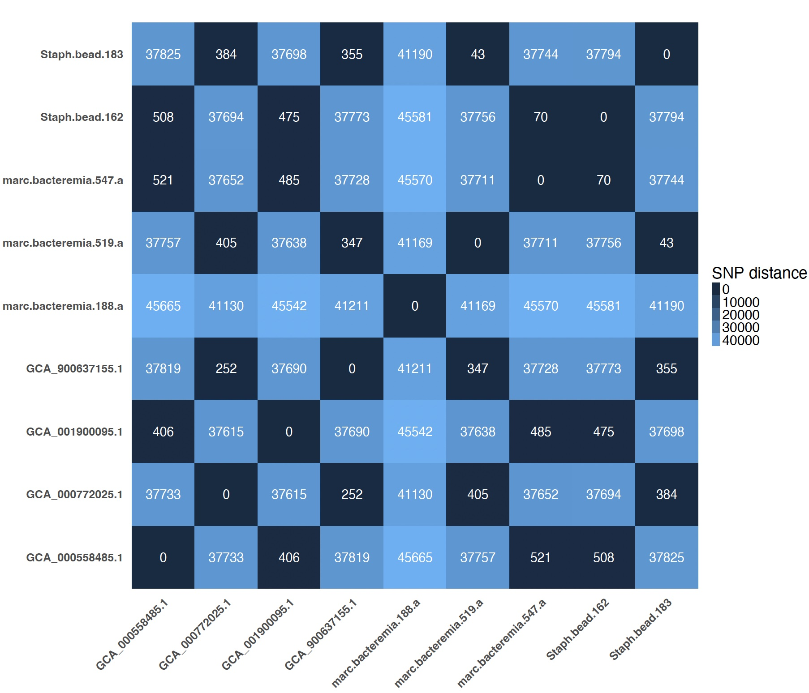

# Microbial Genomics Journey Workshop Gaborone 2024
## Part 6: Reference based analysis

Many of the phylogenetic and comparative genomics approaches use a reference composed of either core genes or a single reference genome. The mapping softwares like bwa and bowtie2 are specialized for mapping short, paired-end, low-divergent sequence reads against a large reference genome. It was originally crafted for eukaryotic genomes such as human genome, where all the sequences should align to one genome.<br/>

Some important considerations when you pick your reference:
* Whenever you have raw reads, use them before thinking of using the assembled genome. Why? Simply because you lose data once you assemble and you want to use as much as possible in this step.
* Any sequence data not in the reference is lost. This missing data decreases the discriminatory power, and may lead to inaccurate statements about relatedness or critical gene/SNP content.
* If you change your reference, your variants called will be different.
* In many of the cases, pangenome and other approaches will be needed to give a better picture of the dataset.
* The choice of a reference may result in errors and it may affect downstream analyses such as the detection of single nucleotide polymorphisms (SNPs) and phylogenetic inference.

There are multiple use cases for using a reference-based approach but we will cover here one of them.

## Snippy
[Snippy](https://github.com/tseemann/snippy) finds SNPs between a haploid reference genome and your NGS sequence reads. It will find both substitutions (snps) and insertions/deletions (indels). It will do that for multiple genomes (raw reads or assembled genomes). It can then take a set of Snippy results using the same reference and generate a core SNP alignment (and ultimately a phylogenomic tree).

Let's produce a core snp alignment for our Staphylococcus  aureus genomes.

* Let's assume we do not know much about this genome. The first question is which genome from the public database I should select to compare this genome to. If you have no knowledge, you may choose the reference that is most commonly used in publication (e.g. N315 for S. aureus and PAO1 for P. aeruginosa). Let's download N315.
* Go to [assembly](https://www.ncbi.nlm.nih.gov/assembly/) page on NCBI. How many assembled genomes are available for S. aureus on GenBank and RefSeq?
* Go to the [genome](https://www.ncbi.nlm.nih.gov/genome/?term=Staphylococcus+aureus) page of S. aureus and then press on Genome Assembly and Annotation report and then search for strain N315. Press on the accession number NC_002745.2. Now let's try to download a fasta file. Press on send to and then select file and then select fasta. This should download the fasta file. Do the same step but for strain Newman (NC_009641.1).

```
cd /data/snippy
ls
less snippy_instruction.sh
```
What is in the script?
`snippy-multi /data/snippy/genomes.tab --ref /data/snippy/N315.fasta --cpus 16 > /data/snippy/snippy.sh`

Now what?! Let's find the SNP distance between all the isolates.
`bash snp_dists_instruction.sh`
What is in the script?
`snp-dists -j 4 -m /data/snippy/result/core.full.aln > /data/snippy/snp-dists_result.txt`



**Number of SNPs will depend on the reference genome used. A closer genome to our study isolate being used as a reference will result in less number of SNPs. A more divergent reference will result in more SNPs.**

**Can we get even a much closer public genome to our isolate?**
Yes, all what we need is a tool that quickly can compare our genome against the database and report the top hit. [Which tool from our previous sessions can do that?](quality.md/#mash) I used it and it reported genome PA57 as the closest from the public database. There is also another tool "WhatsGNU" that I developed that can easily address this issue.<br/>

Some Questions:
* Does this mean I need to do that manually and choose the reference for each study isolate?
* What if I compare multiple study genomes, which reference to use then?
[CladeBreaker](https://github.com/andriesfeder/cladebreaker) will find the answer.

## Further Readings
* [The documentation for bwa](https://bio-bwa.sourceforge.net/bwa.shtml)
* [Evaluation of SNP calling tools](https://www.microbiologyresearch.org/content/journal/mgen/10.1099/mgen.0.000261#tab2)
